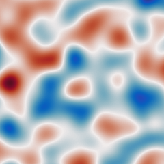
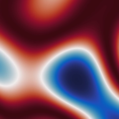

# Quantum Sampling and Moment Estimation for Transformed Gaussian Random Fields -- Supplementary Material

<p align="center">
  </img>&nbsp;&nbsp;&nbsp;&nbsp;</img>
</p>

*Matthias Deiml, Daniel Peterseim, 2025*

Supplementary material to the paper

> We present a quantum algorithm for efficiently sampling transformed Gaussian
> random fields on $d$-dimensional domains, based on an enhanced version of
> the classical moving average method. Pointwise transformations enforcing
> boundedness are essential for using Gaussian random fields in quantum
> computation and arise naturally, for example, in modeling coefficient
> fields representing microstructures in partial differential equations.
> Generating the microstructure from its few statistical parameters directly
> on the quantum device bypasses the input bottleneck. Our method enables an
> efficient quantum representation of the resulting random field and prepares
> a quantum state approximating it to accuracy $\varepsilon > 0$ in time
> $\mathcal{O}(\polylog \varepsilon^{-1})$. Combined with amplitude estimation
> and a quantum pseudorandom number generator, this leads to algorithms for
> estimating linear and nonlinear observables, including mixed and higher-order
> moments, with total complexity $\mathcal{O}(\varepsilon^{-1} \mathrm{polylog}
> \varepsilon^{-1})$. We illustrate the theoretical findings through numerical
> experiments on simulated quantum hardware.

## Running the experiments

This repository contains the code for the numerical experiments of Section 5.
The python dependencies for the code can be installed using

```sh
pip install -r requirements.txt
```

at best this is done in a virtual environment, e.g. [venv](https://docs.python.org/3/library/venv.html).

Afterwards the following files can be run

* `moving_averages.py`, which implements the experiment in Section 5.1 for the
  improved version of the moving averages scheme for generating Gaussian random
  fields. This also generates the image files for Figures 1, 4, and 6(c).
* `random_generator.py`, which contains the quantum implementation of the PCG
  pseudo random generator and outputs the files for Figure 6(a).
* `quantum_circuit.py`, which runs the full quantum implementation of the
  scheme, generating Figure 6(b) and approximating the quantity of interest
  defined in Section 5.3.
* `quantum_circuit_reference.py`, which gives a reference value for the quantity
  of interest defined in Section 5.3.
